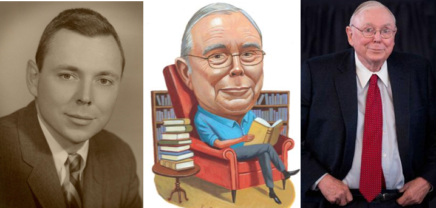

**Created on**: 2020-09-30    

### # Top quotes of Charlie Munger

  1. Take a simple idea and take it seriously.
  1. People calculate too much and think too little
  1. The big money is not in the buying or the selling, but in the waiting.
  1. What are the secrets of success? – one word answer: "rational"
    > rational : based on or in accordance with reason or logic.
  1. Knowing what you don’t know is more useful than being brilliant.
  1. If something is too hard, we move on to something els1. What could be simpler than that?”
  1. Remember that reputation and integrity are your most valuable assets — and can be lost in a heartbeat.
  1. Spend each day trying to be a little wise than you were when you wake up.
  1. I don't care whether the cat is white or black as long as it catches a mouse.
  1. There are whole lots of things, I don’t think about, and one of those things is companies that are losing 2-3 billion dollars a year and going bubbly. Its not my scene.  
  1. I don't have to invest in everything that I'm interested in. I am looking for things where, i think i can predict whats gonna happen with a high degree of accuracy. I don't have that feeling, i have that ability with Uber. 
  1. Spend less than you make; always be saving something. Put it into a tax-deferred account. Over time, it will amount to something. This is such a no-brainer
  1. Its in the nature of stock market to go way down from time to time. Theres no system to avoid bad markets. You cant do it unless you try to time the market, which is a seriously dumb thing to do. Conservative investing with steady savings without expecting miracles is the way to go    
  1. Free speech is required for the booming economy. Charlie munger quoted "Adam Smith"
  1. You fix what can be fixed, what can't be fixed you endure 
  1. Figure out what works and do it
  1. In every setting, avoid maximum downside with small upside. Eg., Drinking and Cocaine

* * * 

### High degree of specialization vs multidisciplinary specialization

In Caltech Interview, Charlies thought were, we should have high degree of specialization. His argument is you should be competent in your specialized area and have common sense over a broad area, if you work at it appropriately

Newton spent most of his powerful creative period in his life Alchemy and theology and later half in professional life being a scientist. It's about managing time to learn new skills or new sport

* * * 

### Charlie Munger, The complete Investor by Tren Griffin    

If you cannot explain why you have failed after you have made the mistake. The business was too complex for you. In other words, WB and Munger like to understand, why they made the mistake ? So they learn from the experience,  
* If you cannot understand the business you cannot determine what you did wrong. 
* If you cannot determine what you did wrong then you cannot learn. 
* If you cannot learn, you cannot know what you are doing. Which is the real cause of risk.

* * * 

### A Conversation with Distinguished Alumnus Charles T. Munger (CERT ’44, CAVU)

I started to take notes while listening to this interview but stopped as seeing comment with notes from *David deSouza*.  

##### 6:00 - Choosing a Career:
* You aren’t going to do well in a career that’s tough.
* Find a career that you enjoy and/or one where you have special advantages.

##### 7:34 - Advice for The Young:
* Underspend and keep investing.

##### 11:45 - Technology:
* Technology can kill your investment as well as be an opportunity.
* It helps to have a position that can’t be taken away by technology

##### 12:35 - Companies are similar to biology:
* Over the long term, big companies behave more like biology. In biology all individuals die and so do all species, it’s just a question of time. Thats pretty well happens in economy too. 

##### 13:51 - How does one learn to deal with change?
(1) Be on the cutting edge
(2) Avoid big changes that is likely to hurt you.

##### 16:58 - Guarding Against Mental Biases in Decision Making:
* Rub your own nose in your own mistakes
* Keep it simple and fundamental
* Have a margin of safety
* Avoid being stupid

##### 18:09 - The Most Important Thing if You Want to Avoid Stupid Errors:
* Know where you are competent and where you are not.
* Know the edge of your own competency. This is hard to do because the human mind tries to make you think you are way smarter than you actually are.

##### 25:01 - Predicting Macroeconomic Change:
* I did not make my fortune by predicting macroeconomic changes better than others. What Buffet and I did was to buy things that were promising, and sometimes we had a tailwind from the economy, and we just kept swimming.

##### 27:00 - Mistakes:
* You can’t live a successful life without doing some difficult things that go wrong.

##### 33:45 - Experts:
* Don’t constantly consult with experts(eg: you have to consult with experts when building a chemical plant). Know the big ideas in all the disciplines and use them routinely in your judgments.

##### 34:37 - Academia:
* Academia is not very good at the interdisciplinary stuff.

##### 35:39 - Investment returns over the next 10 years:
* Returns will be less because so many people are in it and the frenzy is so great and the management reward systems are so foolish.

##### 36:31 - Quantitative Easing
* No country has got by with the kind of money printing we’re doing now without some trouble. We are very near the edge, we’re playing with fire.

##### 41:15 - China
* I’ve had success with the leading companies in China and I think it is going to continue.
* What China success shows is that politics doesn’t matter that much.
* Who would have guessed that a bunch of communist Chinese (run by one party) would have the best economic record the world has ever seen.
* We Americans would like to think that our free expression and allowing all kinds of opinions and criticism of the government is totally essential for the economy.
* What the Chinese have proved is that you can have a successful economy with a fairly controlling government.

##### 42:00 - Being a Good Investor:
* Being a good investor is down to temperament, it’s deferred gratification, you need to be willing to wait.
* Good investing requires a weird combination of patience and aggression. It requires self-awareness.
* You need to know the edge of your own competency.

##### Mungers best advice on learning finance
Well if you pursue any career with enough fanaticism thats very likely to work better than not having the fanaticism
* Look at Warren Buffett, he had this fanatic interest in investments from an early age and he kept making small investments even with his paper out savings and so forth and he finally learned how to be pretty good at it
* If you want to suceed in investments, start early, try hard and keep doing it. All sucess comes that way but by and large

##### 47:41 - What helps Everyone:
* What helps everyone is to get into something that’s going up and it just carries you along without much talent or work.
* So pick a really strong place like Costco and go to work there, be reliable and nice, and you are going to do fine in life.
In elite education no one wants to work for Costco, despite it being the easiest place to get ahead.

##### 49:50 - What are you proudest of ? 
I am proudest of avoiding some things i don't like, 
* i don't like irrationality
	
##### 51:43 - Liberal Arts
* It’s harder to be smart in the liberal arts.
* Many liberal arts professors are so leftist.
* It’s hard to be pretty smart if you’re crazy leftist, you’re going to have the whole world wrong.

##### 54:10 - Philanthropy:
* For someone to be successful you ought to be reasonably generous.
* You don’t get big merit points for philanthropy, but you get a lot of discredit if you aren’t.

### # References
* [Wealth Education](../40-wealth-education)