#### Behaviour changes in each versions 

* 2021/10/17 - Shadowing works. Theme changes can be made to `src\@lekoarts\gatsby-plugin-theme-ui\index.js`
* 2021/07/16 - In release `@lekoarts/gatsby-theme-minimal-blog": "^3.0.2"`, theme changes are *Non-Shadowing* meaning you have to make changes in `node_modules\@lekoarts\gatsby-theme-minimal-blog\src\gatsby-plugin-theme-ui\index.js`. 
* Earlier version these changes can be shadowed and shadowed files were in `src\@lekoarts\gatsby-plugin-theme-ui\index.js`.

* * * 

First lets see the themes and later we shall see the code changes. 

### # Original color theme

**Light**     
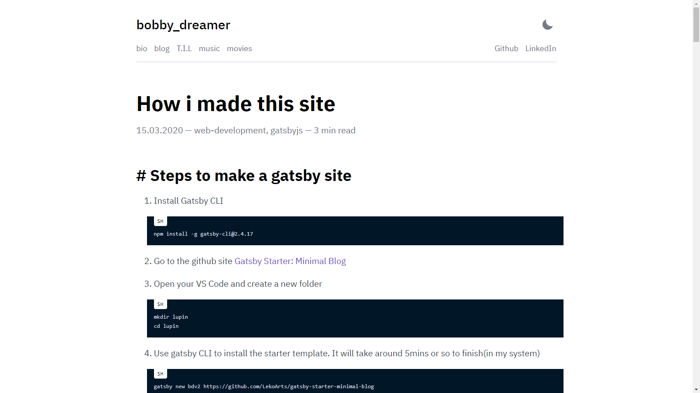  

**Dark**    
This uses 
```sh 
    modes: {
      dark: {
        text: tailwind.colors.gray[4],
        primary: tailwind.colors.purple[5],
        secondary: `#7f8ea3`,
        toggleIcon: tailwind.colors.gray[4],
        background: `#1A202C`,
        heading: tailwind.colors.white,
        divide: tailwind.colors.gray[8],
        muted: tailwind.colors.gray[8],
      },
    },
```    

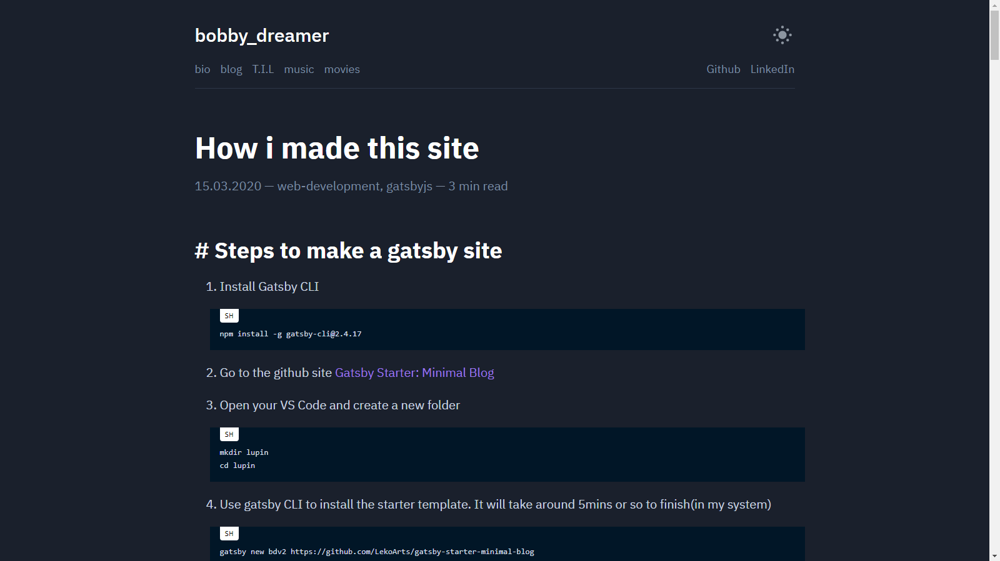  

### # What CSS key correspond to
```sh 
background: page background
primary: post links / selected text
secondary: tags, header links
heading: headings
toggleIcon: light/dark mode
```

### # Light theme : 1
This uses 
```sh
    light:{
      background: `#e8e6d9`,
      secondary: `#f23807`
    }
```    

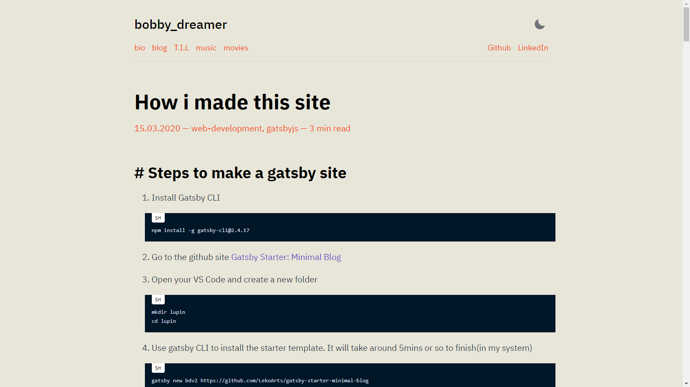 

### # Light theme : 2
This uses
```sh 
    light:{
      background: `#d0e1f9`,
      secondary: `#ee4035`
    }
```    

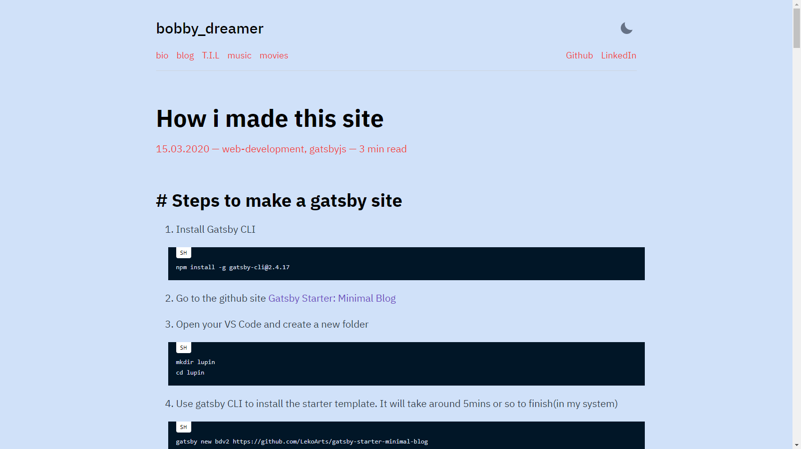 

### # Light theme : 3
This uses 
```sh
    light:{
      background: `#dcf3e8`,
      primary: `#f11818`,
      secondary: `#f11818`,
      heading: `#2f41cd`,
    }
```

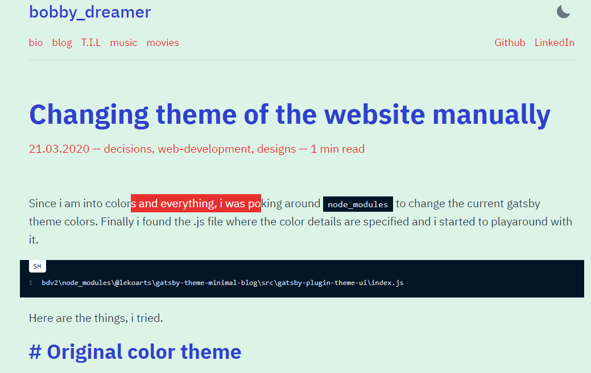 

### # Light theme : 4
This uses 
```sh
      light:{
        background: `#ffd8d8`,
        primary: `#0bbd59`,
        secondary: `#0bbd59`,
        heading: `#2f41cd`,
      }
```

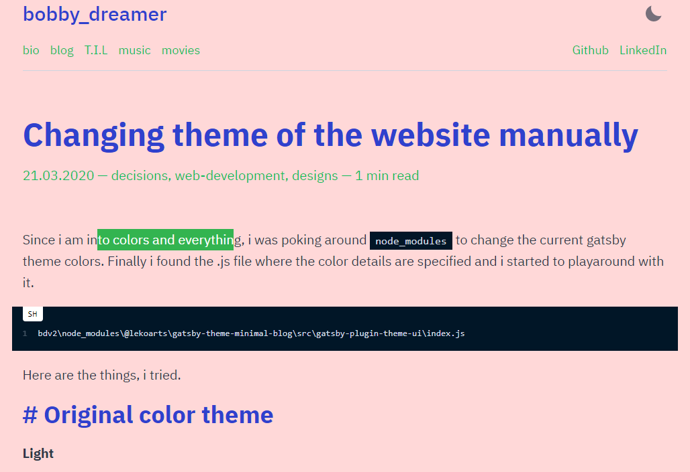 

### # Light theme : 5
This uses 
```sh
    light:{
        background: `#28e49a`,
        heading: `#000000`,
        primary: `#ff0000`,
        secondary: `#ffffff`
    }
```

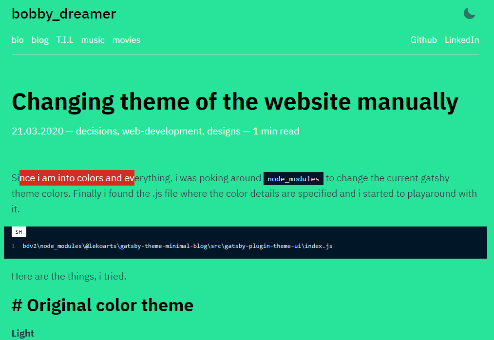

### # Light theme : 6
This uses 
```sh
    light:{
        background: `#e4f7b5`,
        heading: `#0b1ac3`,
        primary: `#8f85c2`,
        secondary: `#e41b3f`
    }
```

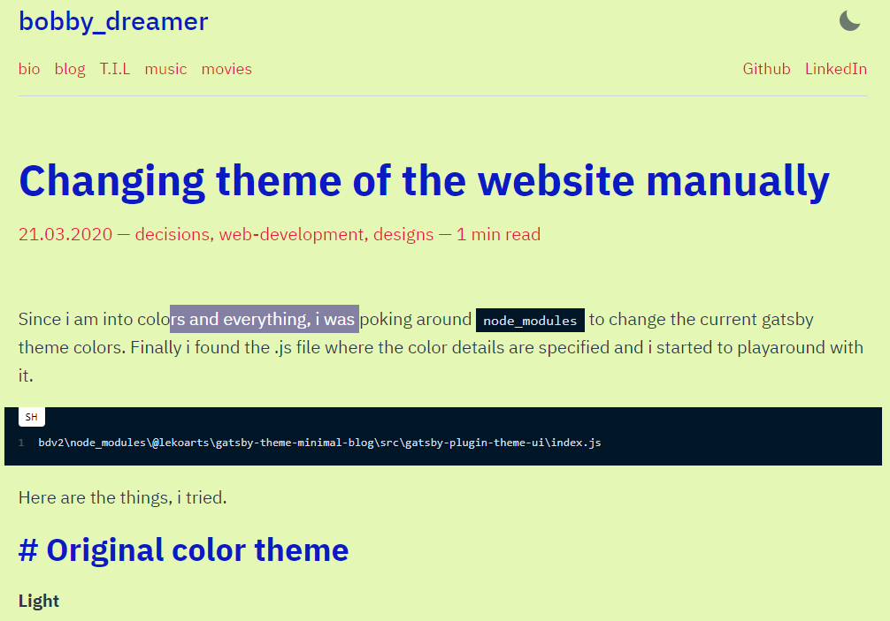 

### # Light theme : 7
This uses
```js
/* Add the below JSON node in colors:{ modes:{ /*add here*/ }} */

      light:{
        background: `#bddccc`, /* Background */        
        primary: `#7400b8`,    /* Alink posted color */
        secondary: `#ee4035`,   /* Alink top menu color */
        divide: tailwind.colors.purple[6], /* HR color */
      },

/* Add fontWeight to styles:{ root:{ /* add here */ } } */
fontWeight: 500,


```

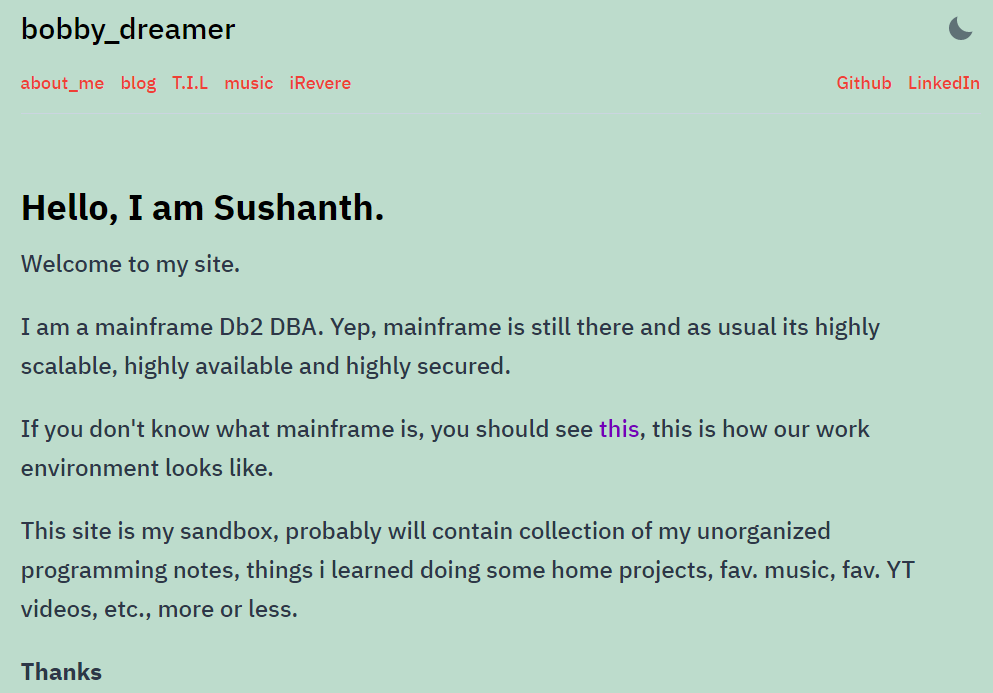 

### # Dark theme : 1
This uses 
```sh 
    dark:{
      background: `#1e172c`,
      secondary: `#f725a0`,
      primary: `#0cb2c0`,
    }
```    

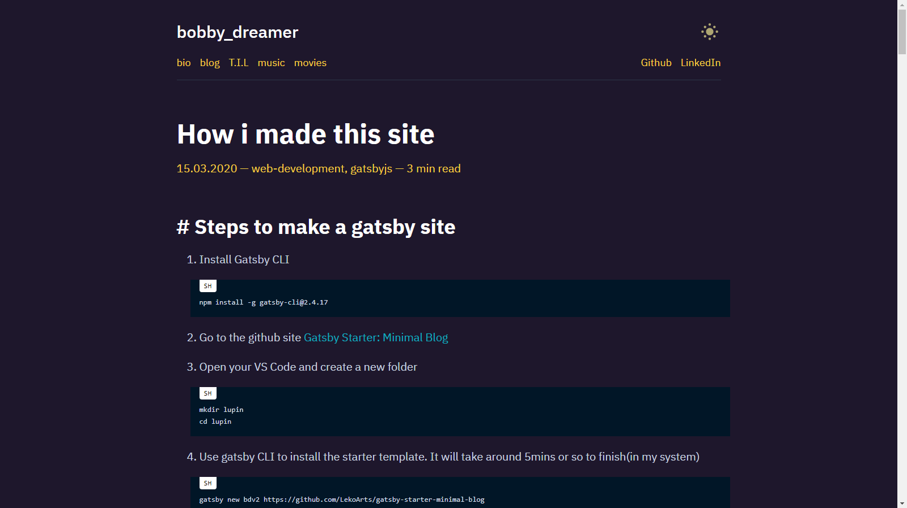 

### # Dark theme : 2
This uses 
```sh 
    dark:{
      primary: `#fad141`,
      background: `#1e172c`,
      secondary: `#2ab7ca`,
      heading: `#ff0080`,
      toggleIcon: `#fdf498`,
    }
```    

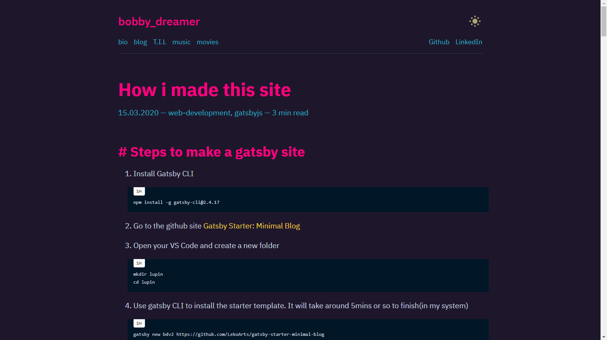 

### # Dark theme : 3 
This theme is inspired from [Brittany Chiang](https://brittanychiang.com/) her website is amazing in so many levels and it uses 
```sh 
    dark:{
      background: `#0a192f`,
      primary: `#fad141`,
      secondary: `#64ffda`,
      heading: `#ccd6f6`,
      toggleIcon: `#fdf498`,
    }
```    

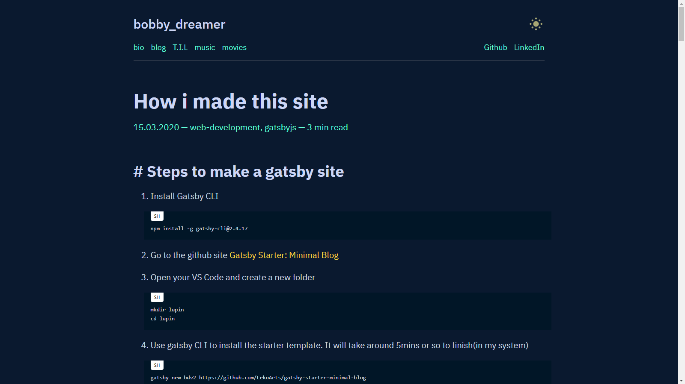 

### # Dark theme : 4 
```sh 
    dark:{
      primary: `#c61a0c`,
      background: `#002a3a`,
      secondary: `#f6411f`,
      heading: `#ffac00`,
      toggleIcon: `#fdf498`,
    }
```    

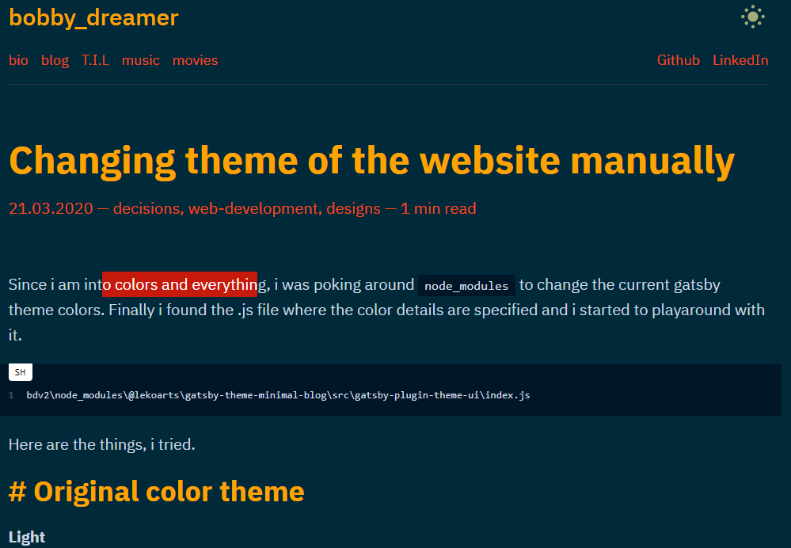 

### # Dark theme : 5
```sh 
    dark:{
      primary: `#ffc884`,
      background: `#30157d`,
      secondary: `#fbff00`,
      heading: `#ffffff`,
      toggleIcon: `#fdf498`,
    }
```    

 

### # Dark theme : 6 
```sh 
    dark:{
      primary: `#f8c7b6`,
      background: `#21403a`,
      secondary: `#ffd758`,
      heading: `#53c07f`,
      toggleIcon: `#fdf498`,
    }
```    

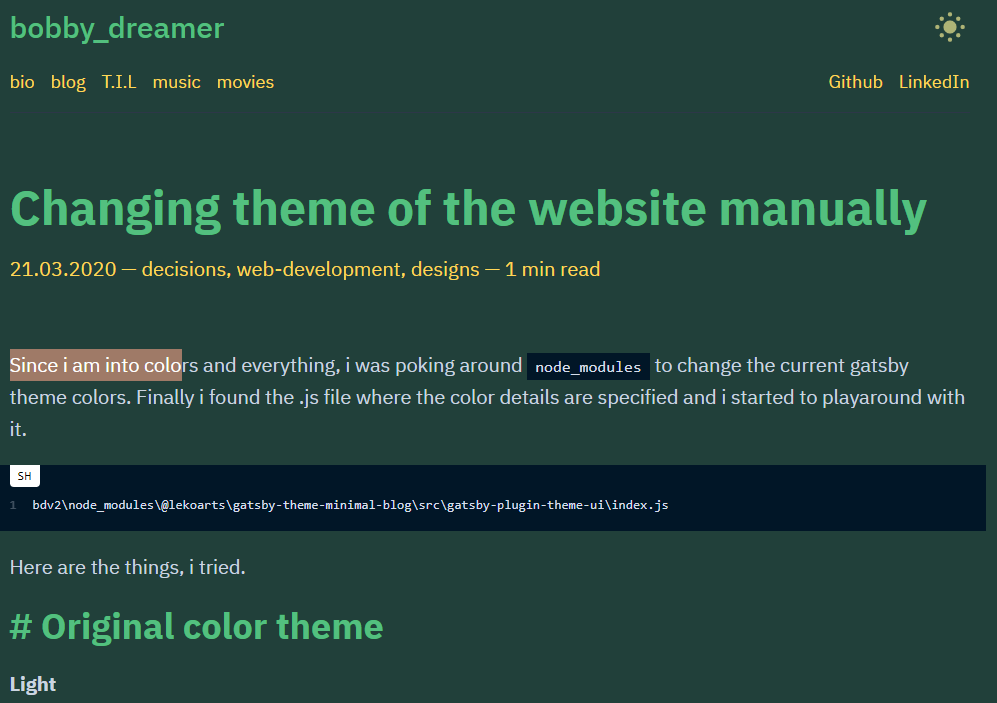  


### # Dark mode inspirations 
Hong Kong neon street colors
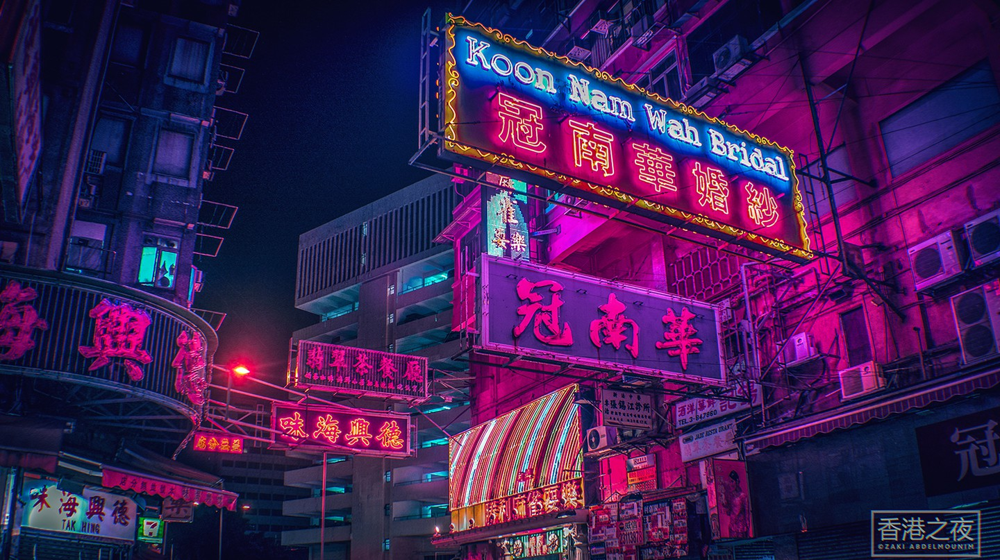 
 

### # You know who he winner is 

1. Light theme 2 (till 28/Nov/2020)
1. Light theme 7 
1. Dark theme 2

### # Making the Non-Shadowing changes

Filepath : `node_modules\@lekoarts\gatsby-theme-minimal-blog\src\gatsby-plugin-theme-ui\index.js`

```js {8-12,14-18,36}
  colors: {
    primary: tailwind.colors.purple[7],
    secondary: `#5f6c80`,
    toggleIcon: tailwind.colors.gray[8],
    heading: tailwind.colors.black,
    divide: tailwind.colors.gray[4],
    modes: {
      light:{
        background: `#bddccc`, /* Background */        
        primary: `#7400b8`,    /* Alink posted color */
        secondary: `#ee4035`   /* Alink top menu color */
      },      
      dark: {
        background: `#1e172c`,
        primary: `#fad141`,
        secondary: `#2ab7ca`,
        heading: `#ff0080`,
        toggleIcon: `#fdf498`,  
        text: tailwind.colors.gray[4],        
        divide: tailwind.colors.gray[8],
        muted: tailwind.colors.gray[8],
      },
    },
  },
...
  styles: {
    root: {
      color: `text`,
      backgroundColor: `background`,
      margin: 0,
      padding: 0,
      boxSizing: `border-box`,
      textRendering: `optimizeLegibility`,
      WebkitFontSmoothing: `antialiased`,
      MozOsxFontSmoothing: `grayscale`,
      fontWeight: 500,
    },
```

### # Next Steps
* [First set of custom changes made to this starter theme](../shadowing-and-non-shadowing)
* [Changes to gatsby-config.js, hero and bottom](../how-i-made-this-site)
* [Adding a Favicon](../adding-favicon-to-gatsby)
* [Deploying & Hosting in Firebase](../deploying-and-hosting-gatsby-site-in-firebase)
